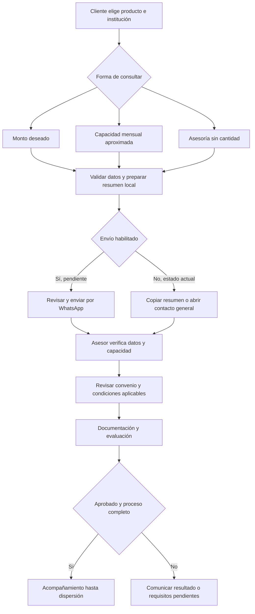

# Respuestas de Alicia aplicadas a la demo

Fuente: cuestionario de contenido respondido y compartido por David. La imagen de Credifiel es referencia visual (respuesta 20), no autorización para adoptar sus requisitos, SMS o condiciones.

- Formulario: nombre, WhatsApp mexicano, producto, institución y monto aproximado. El resumen se prepara localmente y se invalida al editar. Se conserva selección interactiva del monto; se retiró del formulario público el modo ingreso para ajustarlo a los cinco datos solicitados. El motor técnico conserva sus funciones independientes.
- Correo añadido a requisitos; no se solicita en el primer contacto.
- Horarios y dos números oficiales publicados como información. No se elige arbitrariamente el destino del formulario.
- Proceso de cuatro pasos: consulta, orientación, documentación y resultado condicionado a aprobación.
- Retirados testimonios de ejemplo y cifra de 250,000 sin respaldo. No se añadieron promociones ni redes sin URL exacta.
- Se preserva la organización pedida por Miguel y las exclusiones públicas.

## Pendientes

Número principal y función del segundo; URL vigente de privacidad; enlace exacto de Facebook; fotos reales. El envío de consultas continúa deshabilitado y no se guardan datos. Para cotizar: conversión de ingreso neto a capacidad y condiciones por producto permitido.

## Verificación

Build y pruebas automatizadas. Navegador de escritorio: resumen incluye los cinco datos, normaliza +52 y desaparece al editar nombre; botón de envío oculto. Revisión visual de la página publicada. Las pruebas móviles anteriores no constituyen una nueva prueba física de esta versión en teléfonos.

## Aclaración posterior de David: capacidad externa

La capacidad de pago se recibe como dato aproximado del cliente y se verifica con el asesor; no se deriva automáticamente de su ingreso. La web ahora distingue monto deseado, capacidad mensual declarada y asesoría sin cantidad. Esta última descarta cualquier monto anterior del resumen. No se asignan ofertas ni cuotas a partir de una capacidad no verificada. Deja de ser requisito para esta ruta una fórmula de ingreso a capacidad; siguen pendientes las condiciones y calculadoras autorizadas para uso público. Build: 14 grupos de pruebas aprobados.

## Cierre de revisión posterior

- Destino principal confirmado por David: 55 8771 1739, configurado como 525587711739.
- Aviso publicado enlazado: https://www.jubilcredit.com/aviso-de-privacidad. Pendiente confirmar que cubre consultas de crédito; el enlace por sí solo no habilita enviar el resumen.
- Ruta técnica de capacidad SIPRE incorporada y contrastada con los nueve ejemplos de Alicia y nueve filas guardadas del archivo. No se publica como cotizador ni cambia las exclusiones comerciales.
- 16 grupos de pruebas aprobados, incluidas las tres rutas del formulario y el bloqueo del resumen sin habilitación explícita.

## Flujo vigente de la consulta web

El recorrido posterior al contacto lo realiza el equipo, no un CRM automatizado. Se preserva la organización de productos indicada por Miguel. Los cálculos internos no asignan financiera ni aprueban solicitudes.

## Resumen para Miguel

La demo incorpora los datos comerciales confirmados, preguntas frecuentes, ajustes de celular y tablet y contacto general al número autorizado. El formulario distingue monto deseado, capacidad aproximada y asesoría sin cantidad. Se amplió la revisión técnica para reproducir el flujo de capacidad explicado por Alicia. Quedan pendientes la correspondencia del aviso de privacidad con la consulta de crédito, la autorización de condiciones de las calculadoras públicas y la prueba final del envío con el equipo. No se ha sustituido el sitio de Wix ni habilitado aprobación automática.
